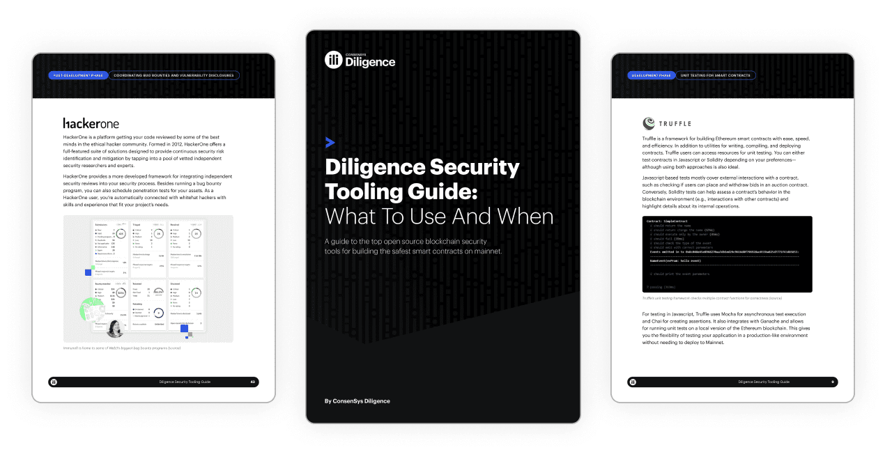

<link href="./index.css" rel="stylesheet"></link>
This section is about tools that can detect vulnerabilities or help developers maintain a high
code quality to reduce the likelihood and impact of vulnerabilities.

| Category                                                        | Description                                                                                         |
| --------------------------------------------------------------- | --------------------------------------------------------------------------------------------------- |
| [Visualization](./visualization.md)                             | These tools are aimed at visualizing, EVM bytecode, smart contracts, and their control flow graphs. |
| [Static and Dynamic Analysis](./static-and-dynamic-analysis.md) | Tools that employ various means of program analysis to find vulnabilities and weaknesses.           |
| [Classification](./classification.md)                           | Resources attempting to classify vulnerabilities and weaknesses in smart contracts.                 |
| [Testing](./testing.md)                                         | Tools for running, measuring, and managing smart contract related tests.                            |
| [Linters and Formatters](./linters-and-formatters.md)           | Any tools that highlight code smells and make smart contract code adhere to format standards.       |
| [Disassemblers and Decompilers](./disassemblers.md)             | Tools that translate smart contract bytecode into opcodes and solidity code.                        |
| [Formal and Runtime Verification](./verification.md)            | Tools employing verification techniques to detect behaviour satisfying or vioating invariants.      |

    

        

            

                
The Diligence Security Tooling Guide

                
Download a free copy of the Diligence Security Tooling Guide to discover the top tools in Web3 you can use at any phase of your smart contract development to test and improve security.

            

            <a href="https://consensys.net/diligence/resources/security-tooling-guide?utm_source=github&utm_medium=devcommunity&utm_campaign=2022_Nov_diligence-security-tooling-guide_content_content" target="_blank">Download guide</a>
        

        

            
        

    

